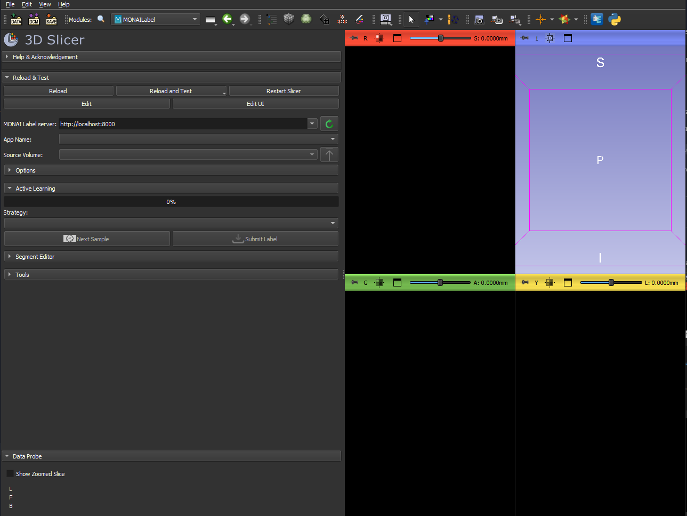
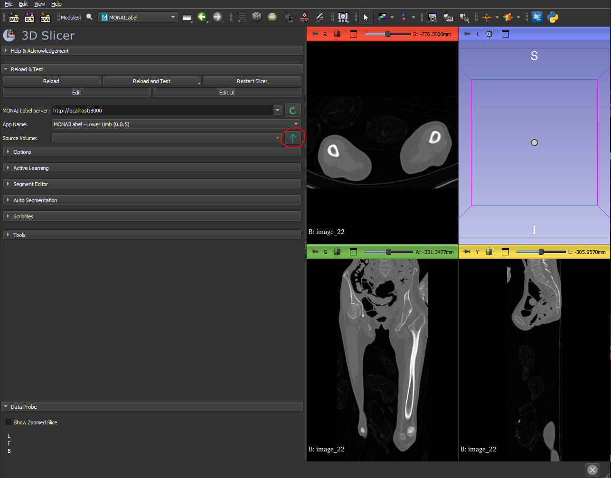

# LowerLimbBundle

**Automatic Lower Limb CT Segmentation with MONAI-Label**

---

## Introduction

LowerLimbBundle is a packaged MONAI-Label application for **automatic segmentation of lower limb CT scans**. It provides:

- A **pre-trained SegResNet** model for volumetric (3D) segmentation of femur, tibia, patella, and other lower-limb bones.
- A **MONAI-Label** server for interactive annotation, inference, and continuous model refinement.
- A **3DSlicer** interface that allows users to segment volumes and make improvements to predictions.
- Full training pipeline so you can fine-tune or retrain the model on your own datasets.

---

## Repository Structure

```
LowerLimbBundle/
├── lib/                       # TaskConfigs, transforms, trainers, and infer handlers
│   ├── configs/
│   │   └── lowerlimb.py       # MONAI-Label training & inference config
│   ├── infer/                 
|   |   └── lowerlimb.py       # Inference task implementation
│   └── trainers/              
|       └── lowerlimb.py       # Training task implementation
├── model/
│   └── model.pt               # Pretrained weights
├── imagesTr/                  # Data and labels
├── main.py                    # MONAI-LabelApp
└── README.md                  # You are here
```

---

## Installation

### 1. Clone the repository

```bash
git clone https://github.com/unsw-cse-comp99-3900/capstone-project-2025-t1-25t1-3900-f13a-APPLE.git

cd LowerLimbBundle
```

### 2. Create and activate a Conda environment

```bash
conda create -n env-name-here -c conda-forge python=3.10

conda activate env-name-here
```

### 3. Python package installation

```bash
pip3 install torch torchvision torchaudio --index-url https://download.pytorch.org/whl/cu118

pip install monai monailabel
```

---

## Usage

### 1. Start the MONAI-Label server

Enter the LowerLimbBundle directory and start the server. Point at your directory of CT image volumes:

```bash
monailabel start_server --app . --studies imagesTr --conf models lowerlimb
```

- **app**: path to this bundle (contains `main.py`).
- **studies**: folder with your `.nii.gz` volumes.
- **--conf models lowerlimb**: selects the LowerLimb inference & train tasks.

Training logs, checkpoints, and re-trained models will live under `model/lowerlimb/train_<name>/`.

To deploy the newly trained weights, copy the chosen `model.pt` into the root `model/model.pt` and restart:

---

## 3DSlicer Interface

To interact with the server on 3DSlicer:

1. Click the magnifying glass next to 'Modules' and select the 'MONAILabel' module.


2. Type in the server URL and click the green refresh button to connect to the server


3. From here you can add a volume to 3DSlicer as you usually would and then press the blue arrow to upload it to the server's database.


4. After that you can use the available drop-down menus to handle auto-segmentation, editing segments and active learning.

---
